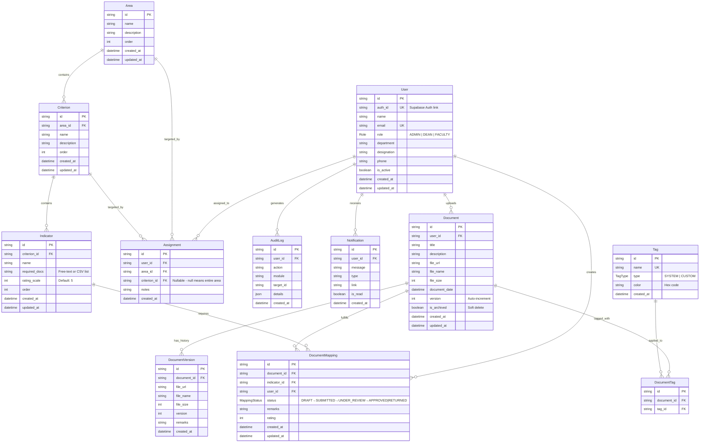

# Database Schema & Data Models

## Overview

The ARMS database uses **PostgreSQL** (hosted on Supabase), managed via **Prisma ORM** (v6). The schema separates the physical document from its logical mapping to accreditation requirements, enabling a single uploaded file to fulfill multiple indicator requirements with independent approval tracking per mapping.

---

## Entity Relationship Diagram (ERD)



---

## Enums

### Role
| Value     | Description                                             |
| --------- | ------------------------------------------------------- |
| `ADMIN`   | System administrator. Manages users, views all data.    |
| `DEAN`    | Program head. Reviews submissions, manages taxonomy.     |
| `FACULTY` | Teacher. Uploads documents, maps to assigned indicators. |

### MappingStatus
| Value          | Description                                  | Flow                   |
| -------------- | -------------------------------------------- | ---------------------- |
| `DRAFT`        | Initial state, not yet submitted for review  | Faculty creates        |
| `SUBMITTED`    | Submitted for dean review                    | Faculty submits        |
| `UNDER_REVIEW` | Dean is actively reviewing                   | Dean starts review     |
| `APPROVED`     | Evidence accepted for the indicator          | Dean approves          |
| `RETURNED`     | Rejected, needs revision                     | Dean returns           |

### TagType
| Value    | Description                              |
| -------- | ---------------------------------------- |
| `SYSTEM` | Pre-defined system tags (cannot delete)  |
| `CUSTOM` | User-created tags for organization       |

---

## Key Design Decisions

### 1. DocumentMapping as Pivot Table
The `DocumentMapping` table is the **heart of the system**. It creates a many-to-many relationship between Documents and Indicators, with per-mapping status tracking. This means:
- A single Document can be mapped to 5 different Indicators.
- Each mapping has its own `DRAFT → APPROVED` lifecycle.
- A document can be APPROVED for Indicator A and RETURNED for Indicator B simultaneously.

### 2. Unique Constraint on DocumentMapping
```prisma
@@unique([documentId, indicatorId])
```
Prevents duplicate mappings — a document can only be linked to a given indicator once.

### 3. Assignment Flexibility & Exclusivity
```prisma
@@unique([userId, areaId, criterionId])
```
- When `criterionId` is `null`, the faculty is assigned to the **entire area** (all criteria).
- When `criterionId` is set, the faculty is assigned to only that specific criterion.
- Application-level constraints ensure that if an entire area is assigned, individual criteria cannot be assigned to another faculty member (and vice-versa) until released.

### 4. Soft-Delete via `isArchived` & `isActive`
- **Documents**: `isArchived: true` hides records from active views. All active queries explicitly filter `{ isArchived: false }`.
- **Users**: `isActive: false` archives user accounts while retaining all historical documents, audit logs, and mappings. Fast user administration queries read directly from Prisma without blocking on external authentication APIs.

### 5. Cascade Deletes
All child relationships use `onDelete: Cascade`:
- Deleting an Area → deletes its Criteria → deletes their Indicators → deletes their Mappings.
- Deleting a User → deletes their Documents → deletes their Mappings.

---

## Database Indexes

### Composite Indexes (Performance-Critical)

| Table              | Index                        | Purpose                                    |
| ------------------ | ---------------------------- | ------------------------------------------ |
| `documents`        | `[isArchived, userId]`       | Archive + repository filters               |
| `document_mappings`| `[status, createdAt]`        | All submissions sorted + status filter     |
| `document_mappings`| `[userId, status]`           | My submissions per user + status filter    |
| `notifications`    | `[userId, isRead]`           | Unread badge count per user                |
| `notifications`    | `[userId, createdAt]`        | Notification list sorted by time           |
| `audit_logs`       | `[createdAt]`                | Dashboard recent activity                  |
| `audit_logs`       | `[userId, createdAt]`        | Per-user audit log pagination              |

### Single-Column Indexes

| Table              | Column                       | Purpose                               |
| ------------------ | ---------------------------- | ------------------------------------- |
| `criteria`         | `areaId`                     | Fetch criteria by area                |
| `indicators`       | `criterionId`                | Fetch indicators by criterion         |
| `document_mappings`| `indicatorId`                | Compliance aggregation queries        |
| `document_mappings`| `userId`                     | Per-user mapping queries              |
| `document_mappings`| `status`                     | Status-based filtering                |
| `assignments`      | `userId`, `areaId`           | Assignment lookups                    |

---

## Security & Policies

### Application-Level Authorization
- **Every Server Action** validates the calling user's role before executing:
  - `requireAdmin()` — only `ADMIN` role.
  - `requireAdminOrDean()` — `ADMIN` or `DEAN` roles.
  - `requireUser()` — any authenticated user.
- **FACULTY queries** are always filtered by `userId` to enforce data isolation.
- **ADMIN and DEAN** have broader read access scopes.

### Database-Level Security
- Direct database access is restricted. All operations flow through Prisma via Server Actions.
- Supabase RLS is not relied upon at the database level — authorization is fully handled at the application layer via Server Action guards.
- Connection string uses `DIRECT_URL` for migrations and `DATABASE_URL` (pooler) for runtime queries.

### Authentication
- Supabase Auth with SSR cookie-based sessions (`@supabase/ssr`).
- Edge middleware validates sessions on every request.
- Service-role client used in Server Actions for admin operations (user creation, password reset).

---

## Migration Notes

- Schema managed via Prisma Migrate.
- Generate client: `npx prisma generate`
- Push schema changes: `npx prisma db push`
- Open studio: `npx prisma studio`
