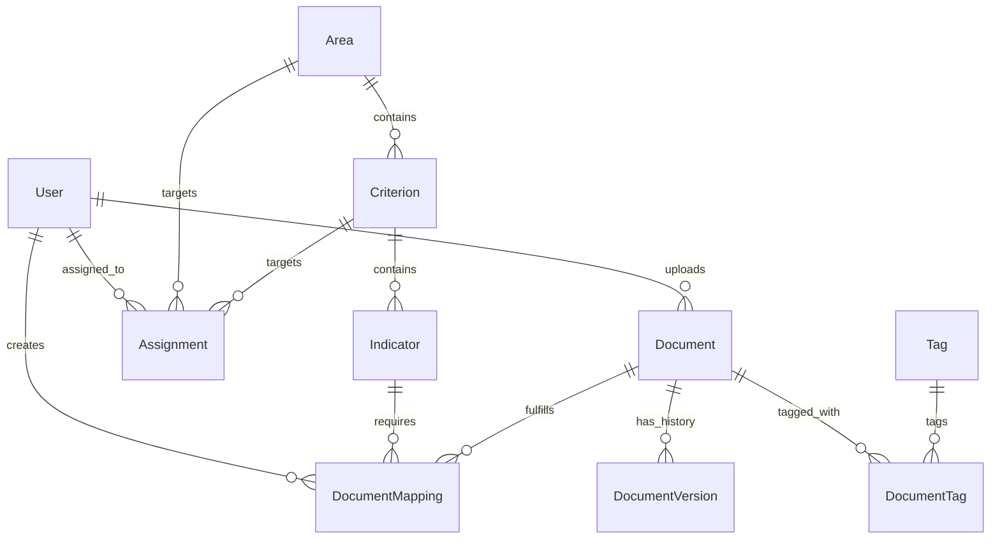

# Database Schema & Data Models

## Overview
The ARMS database uses PostgreSQL, managed via Prisma ORM. The schema is designed to separate the physical document from its logical mapping to accreditation requirements, allowing a single file to fulfill multiple indicators simultaneously.

## Entity Relationship Diagram (ERD)

## Core Entities

### User (`users`)
- Manages authentication and authorization.
- Roles: `ADMIN`, `FACULTY`, `DEAN`.
- Linked to Supabase Auth via `auth_id`.

### Accreditation Hierarchy
1. **Area (`areas`)**: Top-level accreditation categories.
2. **Criterion (`criteria`)**: Sub-categories within an Area.
3. **Indicator (`indicators`)**: Specific requirements that require document evidence.

### Document Management
- **Document (`documents`)**: Represents the physical file metadata (URL, size, name). Uploaded centrally.
- **DocumentVersion (`document_versions`)**: Tracks historical uploads for a document ID to maintain an audit trail of changes.
- **Tag (`tags`) / DocumentTag (`document_tags`)**: Custom metadata labels for filtering documents.

### Workflow & Mapping
- **DocumentMapping (`document_mappings`)**: The crucial M:N pivot table linking a `Document` to an `Indicator`. 
- **MappingStatus**: Tracks the workflow state (`DRAFT`, `SUBMITTED`, `UNDER_REVIEW`, `APPROVED`, `RETURNED`) *per indicator mapping*, not per document.

### System Utilities
- **Assignment (`assignments`)**: Links Users to specific Areas/Criteria for task management.
- **Notification (`notifications`)**: In-app alerts for users.
- **AuditLog (`audit_logs`)**: System-wide tracking of critical actions (creates, updates, deletes) for security and compliance.

## Security & Policies
- **Database Level:** Direct access is restricted.
- **Application Level:** Authorization checks are performed in Server Actions before executing Prisma queries. Queries are always filtered by `userId` for `FACULTY` roles to enforce data isolation, while `ADMIN` and `DEAN` roles have broader access scopes.
